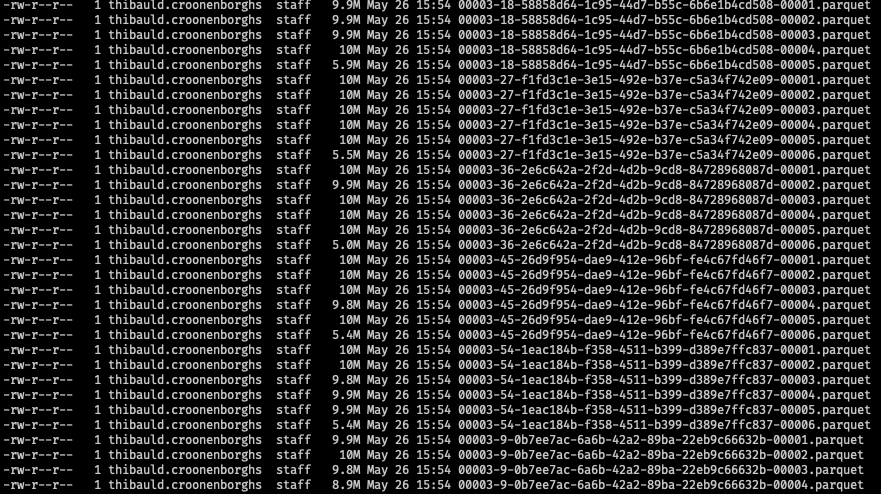

# Performing table maintenance on unpartitioned Apache Iceberg tables using Apache Spark (with Scala and Python) 
## Preface
For this walkthrough we will use [open taxi data](https://www.nyc.gov/site/tlc/about/tlc-trip-record-data.page) 
from New York.

It can be downloaded using this script (for downloading months 1-6 from 2022 at once):

```
#!/bin/bash

# Exit immediately if a  .
set -e

for i in {1..6}; do
  curl -o src/main/resources/data/yellow_tripdata_2022-0$i.parquet https://d37ci6vzurychx.cloudfront.net/trip-data/yellow_tripdata_2022-0$i.parquet
done
```

## Maintenance
### Why perform maintenance on Iceberg tables?
Over time data will accumulate in your Iceberg table and the amount of data and metadata files will grow significantly.
Performing maintenance on your Iceberg tables can have major benefits, such as query performance, reduced storage costs 
and retaining data integrity. 

The key to keeping your tables healthy and performant is by making sure your metadata and data files do not grow too 
large in number. As data is added or deleted from an Apache Iceberg table, the table's metadata can become fragmented, which can impact query performance,
as queries may need to open more files and scan more data than necessary. Iceberg provides a number of actions dealing with maintenance out of the box.

### Rewriting data files

#### Potential problem
Data may arrive in smaller batches in Iceberg tables, due to small writes or due to the ingestion of streaming data.
An issue that arises when ingesting smaller files is that they are faster to write  but not as fast to query. 
When it comes to querying the data it would be more efficient to have fewer larger files with more data.

#### Benefit

Analyzing a query involves using each file’s metadata to calculate how many splits are required and
where to schedule each task to maximize data localization. The more files, the longer this part of query planning will take. 
Large files, on the other hand, can also cause significantly decreased performance by limiting parallelism.

#### Code
To simulate a number of small files arriving into our Iceberg warehouse we will set a table property called 
`write.target-file-size-bytes` to 10Mb. As you can see when adding a few snapshots:



You can choose between 2 strategies when rewriting data files: *binpack* and *sort*.
The *sort* strategy allows for sorting the data using the table sort order or a custom one,
and potentially using *z-order*. We will not go further into this right here.

A common option to provide is the target file size, which is the output size that Iceberg will try
to reach when rewriting files. We will use 100Mb here as an example.

```scala
SparkActions.get(spark)
  .rewriteDataFiles(table)
  .option("target-file-size-bytes", (1024 * 1024 * 100L).toString)
  .binPack
  .execute
```

If you look at the summary of the latest snapshot, you see that 33 data files have been rewritten (**replace** operation) to 4 data files:

```json
{
  "operation" : "replace",
  "added-data-files" : "4",
  "deleted-data-files" : "33",
  "added-records" : "19817583",
  "deleted-records" : "19817583",
  "added-files-size" : "312579175",
  "removed-files-size" : "320381884",
  "changed-partition-count" : "1",
  "total-records" : "19817583",
  "total-files-size" : "312579175",
  "total-data-files" : "4",
  "total-delete-files" : "0",
  "total-position-deletes" : "0",
  "total-equality-deletes" : "0"
}
```

When looking in the data files directory (only 3 files of +- 100Mb are displayed, there is still 1 file of 5Mb):


Achieving the same result in Python with a Spark procedure:
```python
print("to be filled in")
```

### Expiring snapshots
#### Potential problem
As mentioned above data and especially snapshots can accumulate over time .Although Iceberg re-uses unchanged data files
from previous snapshots, sometimes new snapshots require changing or removing data files. These files are only kept for time travel
or rollbacks, but it is recommended to set some sort of data retention period by regularly expiring snapshots.

#### Benefit
Expiring snapshots on your Iceberg tables will have cost benefits as data that is not needed anymore will automatically
be deleted from your storage (which can be significant if you have to maintain a lot of tables). It will also improve
performance, as fewer data needs to be scanned.

#### Code

```scala
SparkActions.get(spark)
  .expireSnapshots(table)
  .expireOlderThan(System.currentTimeMillis())
  .retainLast(1)
  .execute
```

If you look in your metadata file only metadata about the last snapshot should be available. Ideally you would want to 
keep more than 1 snapshot and snapshots older than the current time, but this is used to demonstrate the expiration and 
the fact that only the rewritten files are kept. You can see that the data files related to the expired snapshots have been deleted:


This action explicitly expires snapshots, but metadata files are still kept for history. You can also automatically clean
metadata files by setting the following table properties:

- `write.metadata.delete-after-commit.enabled` to `true`
- `write.metadata.previous-versions-max` to the number of metadata files you want to keep

The data files associated with these deleted metadata files can be removed by the maintenance action that cleans up
orphaned data files (see below).

TODO: check manually the following:
Note that this will only delete metadata files that are tracked in the metadata log and will not delete orphaned metadata files.
Example: With write.metadata.delete-after-commit.enabled=false and write.metadata.previous-versions-max=10, one will have
10 tracked metadata files and 90 orphaned metadata files after 100 commits. Configuring write.metadata.delete-after-commit.enabled=true
and write.metadata.previous-versions-max=20 will not automatically delete metadata files.
Tracked metadata files would be deleted again when reaching write.metadata.previous-versions-max=20.

### Deleting orphan files
#### Potential problem
Sometimes Spark can create partially written files, or files not associated with any snapshots. These files do not have a
reference in the table metadata and are therefore not being picked up through other cleanup actions.

#### Benefit
Running this procedure regularly prevents unused files from accumulating on your storage, thus keeping your folders 
clean and preventing additional storage costs.

#### Code
For demonstrating this procedure we will create an orphan file ourselves (since it will not be referenced by any of the 
metadata files):

```
TS=$(date -j -v-7d +"%Y-%m-%dT%H:%M:%S")
touch -d $TS src/main/resources/warehouse/nyc/taxis/data/partial-file
```
**!** This date command is for OS X, but will be different on other systems.

You can see the file has been added:


We will then remove all orphan files which are older than 7 days (default = 3 days).
```scala
SparkActions.get(spark)
  .deleteOrphanFiles(table)
  .olderThan(System.currentTimeMillis() - 1000L*60*60*24*7)
  .execute
```

Only the `partial-file` has been removed and all other files are left untouched:


Even if you run this with the `olderThan` setting all data files are maintained and only the created orphan file
has been removed.

### Rewriting manifest files
Personally I don't have a lot of experience with this, but I will mention it for completeness. For better scan planning 
it would be beneficial to rewrite the manifest files to obtain optimal sizes.

## Might be helpful

If you are running Spark 3.3.0 and up with Java 17, add the following JVM options:
```
--add-opens=java.base/java.lang=ALL-UNNAMED \
--add-opens=java.base/java.lang.invoke=ALL-UNNAMED \
--add-opens=java.base/java.lang.reflect=ALL-UNNAMED \
--add-opens=java.base/java.io=ALL-UNNAMED \
--add-opens=java.base/java.net=ALL-UNNAMED \
--add-opens=java.base/java.nio=ALL-UNNAMED \
--add-opens=java.base/java.util=ALL-UNNAMED \
--add-opens=java.base/java.util.concurrent=ALL-UNNAMED \
--add-opens=java.base/java.util.concurrent.atomic=ALL-UNNAMED \
--add-opens=java.base/sun.nio.ch=ALL-UNNAMED \
--add-opens=java.base/sun.nio.cs=ALL-UNNAMED \
--add-opens=java.base/sun.security.action=ALL-UNNAMED \
--add-opens=java.base/sun.util.calendar=ALL-UNNAMED \
--add-opens=java.security.jgss/sun.security.krb5=ALL-UNNAMED
```